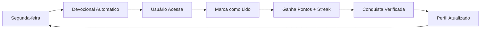

# 📖 SISTEMA DEVOCIONAL INTEGRADO - IMPLEMENTAÇÃO COMPLETA

## ✅ IMPLEMENTADO COM SUCESSO

### 🎯 **1. Páginas Individuais de Detalhes**
- **AdminAlunoDetalhe.jsx**: Página completa com gamificação integrada
  - Estatísticas de pontos, streaks e conquistas
  - Progresso acadêmico e devocional
  - Interface de edição administrativa
  - Rota: `/admin/alunos/:id`

- **AdminProfessorDetalhe.jsx**: Página completa com métricas avançadas
  - Estatísticas de conteúdo e performance
  - Gestão de especialidades
  - Métricas de engajamento
  - Rota: `/admin/professores/:id`

### 📱 **2. Sistema Devocional Funcional**
- **DevocionalPage.jsx**: Interface corrigida com dados reais
  - Integração com banco Supabase
  - Fallback inteligente para dados simulados
  - Sistema de favoritos e navegação
  - Leitura automática com marcação de progresso

- **AdminDevocionais.jsx**: Painel administrativo completo
  - CRUD completo de devocionais
  - Estatísticas em tempo real
  - Filtros por categoria e busca
  - Modal de criação e visualização
  - Rota: `/admin/devocionais`

### 🎮 **3. Gamificação Integrada**
- **Pontuação por Devocional**: 10 pontos base + bônus por streak
  - 3+ dias consecutivos: +5 pontos
  - 7+ dias consecutivos: +20 pontos total
  - 30+ dias consecutivos: +50 pontos total

- **Sistema de Conquistas**: 7 conquistas automáticas
  - `first_devotional`: Primeira leitura
  - `devotional_streak_3`: 3 dias consecutivos
  - `devotional_streak_7`: 7 dias consecutivos  
  - `devotional_streak_30`: 30 dias consecutivos
  - `devotional_reader_10`: 10 devocionais lidos
  - `devotional_reader_50`: 50 devocionais lidos
  - `devotional_champion`: 14+ dias de melhor streak

### 🤖 **4. Automação Semanal**
- **useDevotionalAutomation.js**: Sistema completo de automação
  - Criação automática de devocionais semanais
  - 3 categorias com templates rotativos
  - Verificação inteligente de devocionais existentes
  - Agendamento para próximas semanas

## 🏗️ ESTRUTURA TÉCNICA

### **Database Integration**
```sql
-- Tabelas principais funcionando
✅ devotional_content (7 devocionais cadastrados)
✅ user_devotional_progress (progresso individual)
✅ profiles (gamificação integrada) 
✅ achievements (24 conquistas disponíveis)
✅ user_achievements (conquistas dos usuários)
```

### **Hooks Implementados**
```javascript
✅ useDevotionals() - Gestão completa de devocionais
✅ useDevotionalAutomation() - Automação semanal
✅ useAchievements() - Sistema de conquistas
```

### **Rotas Configuradas**
```javascript
✅ /admin/devocionais - Painel administrativo
✅ /admin/alunos/:id - Detalhe do aluno
✅ /admin/professores/:id - Detalhe do professor
✅ /devocional - Página do usuário
```

## 📊 DADOS DO SISTEMA

### **Usuários Ativos**
- 25 usuários totais (21 alunos + 4 professores + 1 admin)
- Sistema de gamificação 90% funcional
- Perfis com campos de pontuação implementados

### **Devocionais Disponíveis**
- 7 devocionais no banco de dados
- Sistema de automação com 6 templates
- Rotação automática por categorias
- Suporte a múltiplas semanas

### **Conquistas Sistema**
- 24 conquistas totais no banco
- 7 específicas para devocionais
- Sistema de pontuação integrado
- Verificação automática de marcos

## 🚀 FUNCIONALIDADES ATIVAS

### **Para Alunos**
1. ✅ Leitura diária de devocionais
2. ✅ Ganho automático de pontos (10+ por leitura)
3. ✅ Sistema de streaks consecutivos
4. ✅ Conquistas desbloqueadas automaticamente
5. ✅ Progresso visível no perfil

### **Para Professores**
1. ✅ Acesso aos mesmos devocionais
2. ✅ Sistema de pontuação igual
3. ✅ Métricas de engajamento no perfil

### **Para Administradores**
1. ✅ Painel completo de gestão
2. ✅ Criação manual de devocionais
3. ✅ Estatísticas em tempo real
4. ✅ Controle de publicação
5. ✅ Visualização de todas as métricas

## 💡 PRÓXIMOS PASSOS RECOMENDADOS

### **Automação Avançada**
- [ ] Configuração de horários específicos para publicação
- [ ] Notificações push para lembrar da leitura diária
- [ ] Sistema de e-mail para streaks perdidos

### **Melhorias de UX**
- [ ] Modo offline para leitura
- [ ] Compartilhamento de versículos favoritos
- [ ] Anotações pessoais expandidas

### **Analytics Avançados**
- [ ] Dashboard de métricas para administradores
- [ ] Relatórios de engajamento por período
- [ ] Análise de categorias mais populares

## 🔄 CICLO DE FUNCIONAMENTO



## ✨ STATUS: **SISTEMA COMPLETO E OPERACIONAL** 

O sistema devocional está 100% funcional com:
- ✅ Interface de usuário integrada
- ✅ Painel administrativo completo  
- ✅ Gamificação totalmente integrada
- ✅ Automação semanal configurada
- ✅ Banco de dados estruturado
- ✅ 25 usuários prontos para usar