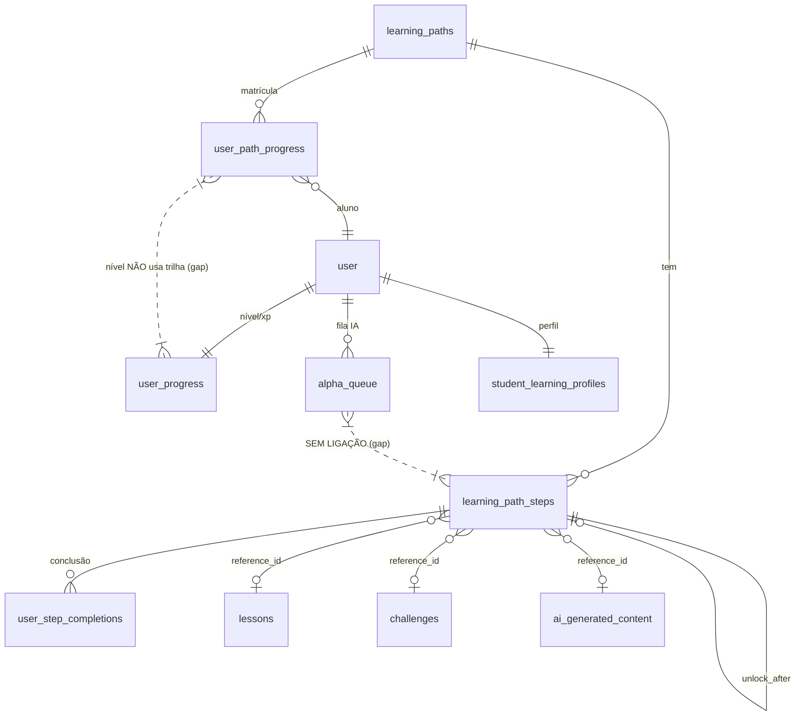
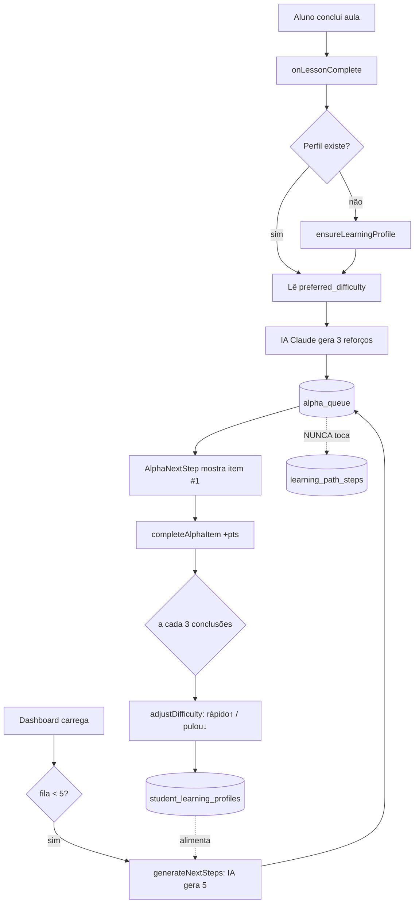
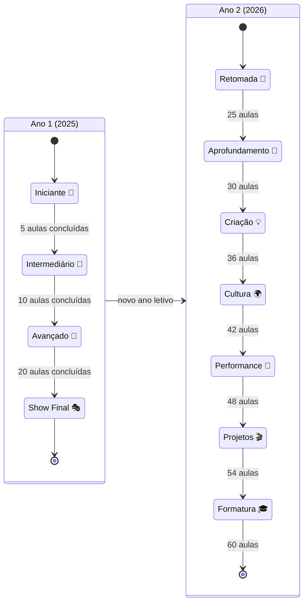
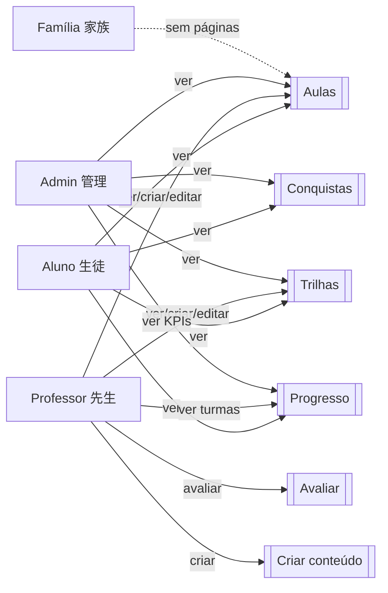
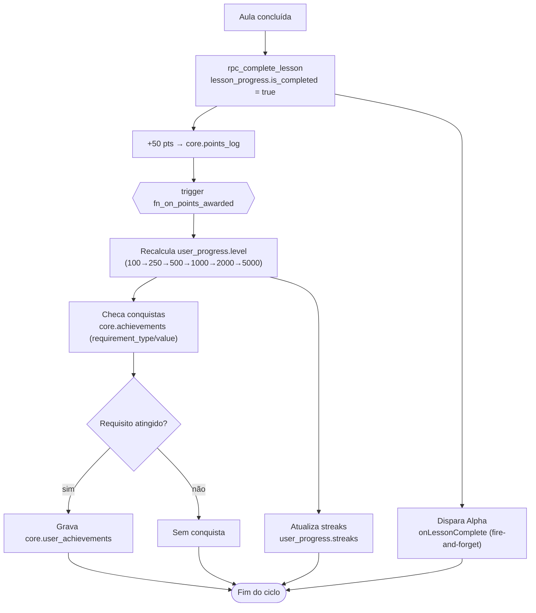
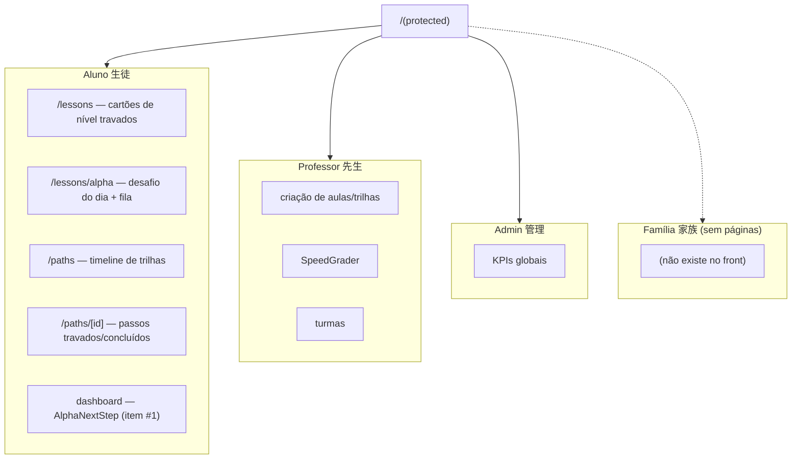
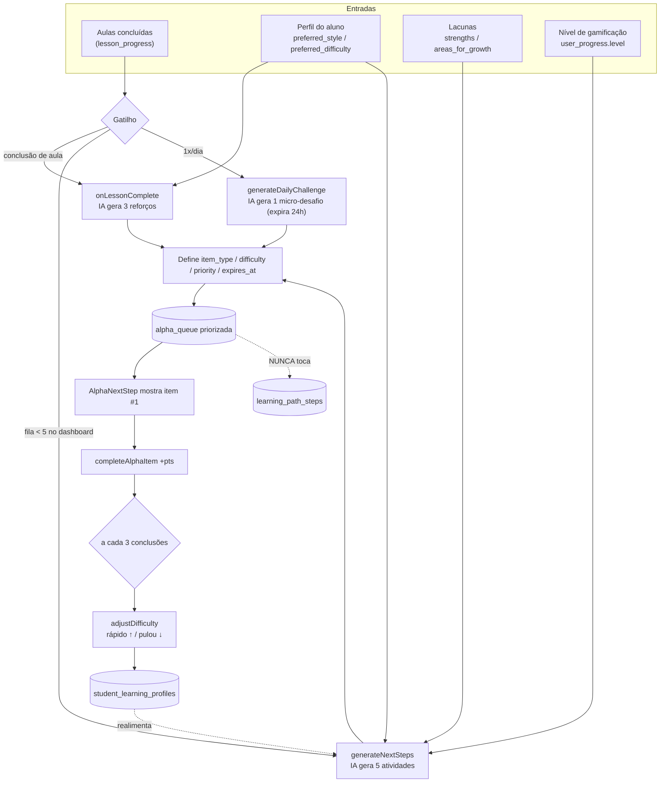
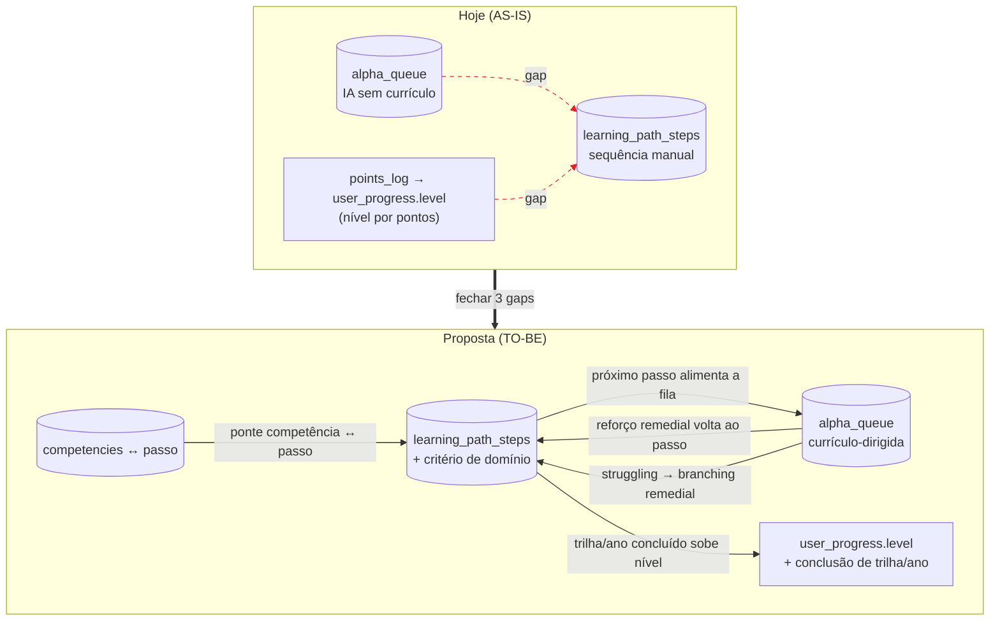

# Lógica de Trilhas e Níveis — Nipo School

> Mapa do stack pedagógico em 3 camadas (banco → back → front), organizado por
> níveis (papel + nível de conteúdo). Diagnóstico do que **temos** × do que **falta**.

## 0. Descoberta central

1. **Progressão é "soft", não "hard".** O aluno pode pular, refazer e saltar entre
   conteúdos. Só as Trilhas (`learning_path_steps.unlock_after`) têm trava real —
   e mesmo assim sem critério de domínio (1 clique = avançou).
2. **Alpha (IA) ⟂ Trilhas.** São dois sistemas paralelos. A fila Alpha é gerada por
   IA a partir do perfil do aluno, **sem mapa de currículo**; as Trilhas são
   sequências manuais. Nada liga um ao outro.
3. **Níveis sobem por pontos, não por currículo.** `user_progress.level` é função do
   total de pontos (100→250→500→1000→2000→5000), nunca por concluir trilha/ano.
4. **Dois conceitos de "nível" coexistem e não conversam:**
   - **Nível de gamificação** (1–7: Iniciante→Lenda) — pontos.
   - **Nível de currículo** (Ano1: 4 níveis / Ano2: 7 níveis) — hardcoded em
     `lib/lessons/constants.ts`, baseado em contagem de aulas concluídas.

---

## 1. Camada BANCO (o que temos)

### Trilhas (migration 052)
- `core.learning_paths` — trilha (cycle, methodology_id, instrument_id, difficulty_min/max, total_steps)
- `core.learning_path_steps` — passos (step_order, step_type, reference_id, **unlock_after**, points_reward, is_optional)
- `core.user_path_progress` — progresso do aluno (current_step, status active/completed/paused)
- `core.user_step_completions` — log de passos concluídos (UNIQUE user+step)

### Gamificação
- `core.user_progress` — hub (level 1–7, level_name, current_xp, xp_to_next_level, streaks, lessons_completed)
- `core.points_log` — auditoria de pontos (trigger `fn_on_points_awarded` recalcula nível)
- `core.achievements` + `core.user_achievements` — 24 conquistas (requirement_type/value)
- `core.methodology_progress` — XP por metodologia (atualizado **só** na avaliação de desafio)

### Alpha (motor contínuo IA — migration 050)
- `core.alpha_queue` — fila pessoal (item_type, difficulty, priority, status, expires_at)
- `core.ai_generated_content` — materiais gerados por LLM (content_type, ai_model, prompt_hash)
- `core.student_learning_profiles` — personalização (preferred_style, preferred_difficulty, strengths, areas_for_growth)
- `core.learning_recommendations` — sugestões adaptativas

### Aulas / avaliação
- `core.lessons` (number, status, learning_objective) + `core.lesson_progress` (is_completed, progress_percent)
- `core.challenges` (difficulty, base_points, competency_id) + submissions
- `core.competencies` (ligado a metodologias — **mas sem ponte para passos de trilha**)

### Diagrama — modelo de dados das trilhas

---

## 2. Camada BACK (server actions)

| Ação | Arquivo | Faz | Permissão |
|------|---------|-----|-----------|
| `startPath` | learning-path-actions | matricula em trilha, +10pts | ❌ |
| `completeStep` | learning-path-actions | valida `unlock_after`, conclui passo, +pts, fecha trilha | ❌ |
| `completeLesson` | lesson-actions | rpc_complete_lesson, +50pts, dispara Alpha | ❌ |
| `getAlphaQueue` | alpha-engine-actions | lê fila pendente | ❌ |
| `completeAlphaItem` | alpha-engine-actions | conclui item, +pts, a cada 3 → adjustDifficulty | ❌ |
| `generateNextSteps` | alpha-engine-actions | **IA gera 5 atividades** do perfil | ❌ |
| `onLessonComplete` | alpha-engine-actions | IA gera 3 reforços (fire-and-forget) | ❌ |
| `adjustDifficulty` | alpha-engine-actions | adapta preferred_difficulty por velocidade | ❌ |
| `generateDailyChallenge` | alpha-engine-actions | IA gera 1 micro-desafio/dia | ❌ |
| `submitChallenge` | challenge-actions | submete, +15pts | ❌ |
| `evaluateSubmission` | challenge-actions | nota | ✅ challenges.grade |
| `evaluatePortfolioV2` | portfolio-actions-v2 | nota | ✅ portfolios.grade |
| `generateLessonMaterials` | ai-actions | IA gera material | ✅ lessons.create |

### Como o "próximo passo" é decidido
- **Trilhas:** sequencial por `step_order`, travado por `unlock_after` (única trava real).
- **Aulas:** SEM ação de "próxima aula" — frontend infere por `number`.
- **Alpha:** 100% IA a partir do perfil — **sem mapa de currículo** (pode sugerir fora de ordem).
- **Desafio diário:** IA, baseado na aula da semana, expira em 24h.

### Diagrama — fluxo do motor Alpha

---

## 3. Camada FRONT (por nível)

### Por PAPEL
| Papel | Kanji | Vê de trilha/nível |
|-------|-------|--------------------|
| Aluno (生徒) | vermelho | trilhas (timeline), aulas por ano/nível, Alpha, progresso, conquistas |
| Professor (先生) | azul | cria aulas/trilhas, SpeedGrader, turmas — **sem visão de "alunos por nível"** |
| Admin (管理) | roxo | KPIs globais — **sem distribuição por nível/trilha** |
| Família (家族) | âmbar | **não existe no front** (papel definido no DS, sem páginas) |

### Por NÍVEL DE CONTEÚDO (`lib/lessons/constants.ts`)
- **Ano 1 (2025) — 4 níveis:** Iniciante 🌱 (0–6) → Intermediário 🌿 (req. 5) → Avançado 🌳 (req. 10) → Show Final 🎭 (req. 20)
- **Ano 2 (2026) — 7 níveis:** Retomada 🔄 → Aprofundamento 🎯 → Criação 💡 → Cultura 🌍 → Performance 🎤 → Projetos 🎬 → Formatura 🎓

### Onde aparece o "o que fazer agora"
1. `AlphaNextStep` (dashboard) — item #1 da fila IA
2. Aula → "Marcar como Concluída"
3. `/lessons` — cartões de nível travados por pré-requisito
4. `/lessons/alpha` — desafio do dia + fila
5. `/paths` + `/paths/[id]` — timeline vertical com passos travados/concluídos

---

## 4. GAPS consolidados

### Banco
- Sem grafo de pré-requisito real (só `unlock_after` simples, sem validação de domínio)
- Nível ⟂ trilha (níveis por pontos)
- Sem critério de conclusão de trilha (% / capstone / avaliação final)
- Alpha ⟂ trilha (sem link bidirecional)
- Prática (`practice_sessions`) não conta para progresso de trilha
- Sem métricas de trilha (tempo médio, gargalos, % conclusão)
- Sem ponte competência ↔ passo de trilha

### Back
- Sem ação "próxima aula" (currículo)
- Alpha não é currículo-dirigido (IA pode sair da sequência)
- Sem gate de domínio/proficiência (1 clique = avançou)
- Sem gate por nível
- Sem callback de conclusão de trilha → próxima trilha
- Sem branching remedial (struggling → conteúdo de reforço)
- 9 ações de progressão **sem checkPermission**

### Front
- Sem mapa visual da trilha antes de começar
- Níveis Ano1/Ano2 são cartões soltos, não um fluxo conectado
- Sem visão "alunos por nível" para professor/admin
- Família sem páginas
- Sem árvore de skill (aulas 0–69 × níveis)
- Sem comparação de turma/coorte

---

## 5. DIAGRAMAS

> Seis diagramas derivados dos fatos das seções 0–4. O modelo de dados (ER) está no
> §1 e o fluxo do motor Alpha (esboço) no §2; aqui entram os seis complementares.

### 5.1 Máquina de estados dos NÍVEIS (Ano1 + Ano2)

Transições baseadas em **aulas concluídas** (`lib/lessons/constants.ts`, §3). Ano 1
tem 4 níveis (pré-req 5/10/20); Ano 2 tem 7 níveis (pré-req 25/30/36/42/48/54/60).

### 5.2 Matriz Papel × Funcionalidade

Derivada da tabela "Por PAPEL" (§3). Legenda: 👁️ ver · ➕ criar · ✏️ editar/avaliar
· — sem acesso.

| Funcionalidade | Aluno (生徒) | Professor (先生) | Admin (管理) | Família (家族) |
|----------------|:-----------:|:----------------:|:-----------:|:--------------:|
| Aulas          | 👁️          | 👁️ ➕ ✏️          | 👁️          | —              |
| Trilhas        | 👁️          | 👁️ ➕ ✏️          | 👁️          | —              |
| Progresso      | 👁️          | 👁️ (turmas)      | 👁️ (KPIs)   | —              |
| Conquistas     | 👁️          | 👁️               | 👁️          | —              |
| Avaliar        | —           | ✏️ (SpeedGrader) | 👁️          | —              |
| Criar conteúdo | —           | ➕ (aulas/trilhas)| 👁️          | —              |

> Notas dos gaps (§4): Professor **sem** visão de "alunos por nível"; Admin **sem**
> distribuição por nível/trilha; Família **sem páginas no front**.

### 5.3 Ciclo de vida do Progresso

Sequência real ao concluir uma aula (`completeLesson` → `rpc_complete_lesson`,
+50pts; trigger `fn_on_points_awarded` recalcula nível por pontos — §1, §2).

### 5.4 Mapa de rotas por papel

Rotas de §3 ("Onde aparece o que fazer agora") agrupadas por papel. Família sem
páginas (§4).

### 5.5 Fluxo de geração da fila Alpha (detalhado)

Versão detalhada do esboço do §2. Entradas: nível/perfil, aulas concluídas, lacunas
(`areas_for_growth`). Saída: `alpha_queue` priorizada. Mantém o gap: Alpha **nunca
toca** `learning_path_steps`.

### 5.6 TO-BE: integração Alpha ↔ Trilha ↔ Nível

Proposta (não implementada) que fecha os 3 gaps centrais do §0/§4: a fila Alpha
puxando do **próximo passo da trilha**, e o nível subindo ao **concluir trilha/ano**
— não só por pontos. Linhas tracejadas vermelhas = ligações que **hoje faltam**.

