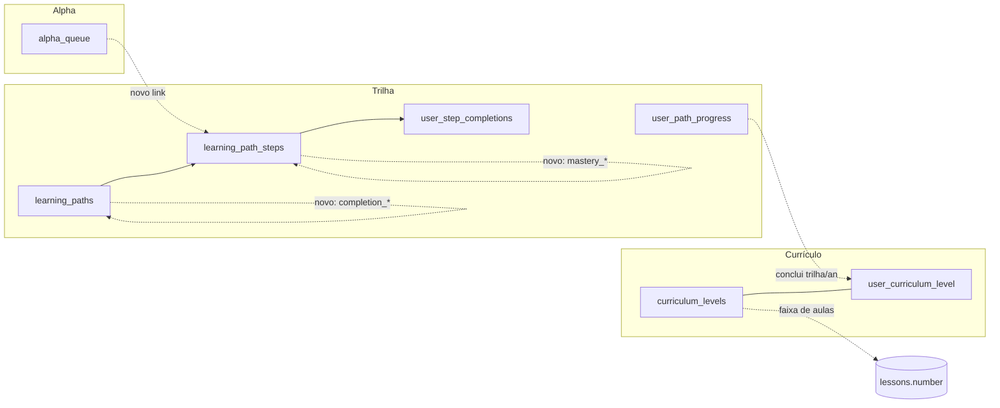

# Proposta — Integração Alpha ↔ Trilha ↔ Nível

> **Estado:** proposta de design. Nada aqui está aplicado. Toda mudança de banco está
> apenas no rascunho `066_alpha_trilha_nivel_DRAFT.sql` (não aplicado). As mudanças de
> código são descritas como **spec** — nenhum `.ts` foi editado.
>
> Objetivo: fechar os 3 gaps centrais diagnosticados em
> [[LOGICA_TRILHAS_E_NIVEIS]] sem quebrar nenhum fluxo que já funciona.

---

## 0. Os 3 gaps que esta proposta fecha

| # | Gap (estado atual) | Resultado desejado |
|---|--------------------|--------------------|
| **(a)** | **Alpha ⟂ Trilha** — a fila `core.alpha_queue` é 100% IA a partir do perfil, sem nenhum vínculo com `core.learning_path_steps`. | A fila Alpha **pode** apontar para o próximo passo da trilha ativa do aluno (link opcional), priorizando o currículo antes de gerar conteúdo solto por IA. |
| **(b)** | **Nível ⟂ Currículo** — `user_progress.level` (1–7) sobe só por pontos; os níveis de currículo (Ano1: 4 / Ano2: 7) são hardcoded em `lib/lessons/constants.ts` por contagem de aulas, e nada liga conclusão de trilha/ano a avanço. | Existe uma tabela de **níveis de currículo** ligada a ano + faixa de aulas, e o avanço de nível passa a poder ser **derivado de conclusão de trilha/ano** (registrado em banco), não só de pontos. |
| **(c)** | **Progressão "soft" sem gate de domínio** — `completeStep` só checa `unlock_after` (1 clique = avançou); não há critério de proficiência. | Existe um **gate de domínio configurável** (nota mínima / % de acerto) por passo e por trilha, **desligado por padrão** (mantém o comportamento atual de 1 clique). |

**Princípio inviolável da proposta:** tudo é **aditivo e não-bloqueante por padrão**.
Se nenhuma coluna nova for preenchida, o sistema se comporta exatamente como hoje.

---

## 1. Visão geral da solução

Três peças novas, todas em `schema core`, todas opcionais:

1. **Ponte Alpha → Trilha** (gap a): coluna nova `learning_path_step_id` em
   `core.alpha_queue`. Quando a fila do aluno está baixa, o motor Alpha primeiro
   tenta **enfileirar o próximo passo da trilha ativa** (item determinístico, sem IA);
   só recorre à geração por IA se não houver passo de trilha disponível. O conteúdo
   gerado por IA continua existindo exatamente como hoje (com `learning_path_step_id = NULL`).

2. **Níveis de currículo em banco** (gap b): tabela `core.curriculum_levels`
   (espelha `lib/lessons/constants.ts` — ano, slug, faixa de aulas, pré-requisito) +
   tabela `core.user_curriculum_level` (nível de currículo atingido por aluno).
   A "ligação nível ↔ ano" passa a ter representação relacional; o avanço pode ser
   recalculado por conclusão de aulas/trilha. **Não substitui** `user_progress.level`
   (gamificação por pontos continua intacta) — é uma dimensão paralela.

3. **Gate de domínio configurável** (gap c): colunas de critério em
   `core.learning_path_steps` (`mastery_required`, `mastery_min_score`,
   `mastery_source`) e em `core.learning_paths` (`completion_criteria`,
   `completion_min_percent`). Defaults preservam o comportamento atual
   (`mastery_required = false`).

---

## 2. Decisões de design (com alternativas e trade-offs)

### D1 — Como ligar Alpha à Trilha
**Decisão:** coluna nullable `learning_path_step_id uuid` em `core.alpha_queue`
referenciando `core.learning_path_steps(id) ON DELETE SET NULL`.

- **Alternativa A (escolhida):** uma coluna FK dedicada. O `source_type`/`source_id`
  já existentes continuam para conteúdo IA; a coluna nova é explícita e indexável.
- **Alternativa B (rejeitada):** reusar `source_type = 'path_step'` + `source_id`.
  Rejeitada porque `source_id` não tem FK (é polimórfico) e perderíamos integridade
  referencial e `ON DELETE SET NULL`; também complicaria a `v_alpha_queue` (JOIN
  condicional já é frágil).
- **Trade-off:** uma coluna a mais por linha. Custo desprezível; ganho é integridade
  e query direta ("itens da fila que são passos de trilha").

### D2 — Quem decide o "próximo passo" na fila
**Decisão:** prioridade **currículo-primeiro, IA-depois**, decidida no server action
(`generateNextSteps`), não em trigger de banco.

- **Alternativa A (escolhida):** lógica na server action. Mantém o motor Alpha onde já
  está (TypeScript, com acesso ao `ai-client`), reversível por feature flag, sem tocar
  em triggers.
- **Alternativa B (rejeitada):** trigger SQL que insere passo de trilha na fila ao
  concluir aula. Rejeitada por acoplar regra pedagógica ao banco e dificultar rollback.
- **Trade-off:** a regra fica no app (precisa deploy para mudar). Aceitável — é o padrão
  atual do projeto (Alpha já é todo em server action).

### D3 — Níveis de currículo: banco vs. constants.ts
**Decisão:** **espelhar** `constants.ts` em `core.curriculum_levels` (seed idempotente),
mantendo `constants.ts` como fonte de verdade do **front** por enquanto.

- **Alternativa A (escolhida):** banco espelha constants; ambos coexistem. Permite que
  o back recalcule nível de currículo via SQL e que professor/admin futuramente vejam
  "alunos por nível" — sem quebrar nenhuma tela que hoje lê `constants.ts`.
- **Alternativa B (rejeitada agora):** mover a verdade 100% para o banco e fazer o front
  ler de view. Mais limpo no longo prazo, mas é mudança **substitutiva** (viola a regra
  de não alterar comportamento existente). Fica como fase futura.
- **Trade-off:** duplicação temporária constants ↔ tabela. Mitigado por: o seed da
  migration reproduz exatamente as faixas de `constants.ts`; documentar que constants é
  a fonte até a migração de front.

### D4 — Avanço de nível: pontos vs. currículo
**Decisão:** **não** alterar `user_progress.level` nem o trigger `fn_on_points_awarded`.
Introduzir dimensão paralela `user_curriculum_level` (nível pedagógico), recalculável.

- **Alternativa A (escolhida):** dimensão paralela. Gamificação (pontos→nível) intacta;
  nível pedagógico é um conceito novo, separado, que pode ligar conclusão de trilha/ano.
- **Alternativa B (rejeitada):** redefinir `user_progress.level` para depender de
  currículo. Quebraria conquistas (`requirement_type = 'level'`), a régua de XP e a UI.
- **Trade-off:** dois "níveis" continuam coexistindo (já coexistem hoje). A proposta os
  **nomeia e separa formalmente** em vez de fundir — decisão consciente para não quebrar.

### D5 — Gate de domínio
**Decisão:** critério **por passo** (`learning_path_steps.mastery_*`) e **por trilha**
(`learning_paths.completion_*`), **desligado por default**.

- **Alternativa A (escolhida):** flags + thresholds configuráveis, default off. O
  `completeStep` só aplica o gate quando `mastery_required = true`.
- **Alternativa B (rejeitada):** gate global rígido. Quebraria o fluxo "soft" atual e
  todas as trilhas já existentes (que assumem 1 clique).
- **Trade-off:** lógica condicional a mais em `completeStep`. Pequena, e protegida por
  default que reproduz o comportamento atual.

### D6 — Fonte da nota de domínio (`mastery_source`)
**Decisão:** enum textual `'lesson' | 'challenge' | 'portfolio' | 'none'`. Para passos
do tipo `challenge`/`portfolio`, a nota vem de `core.challenge_submissions.grade` /
`core.portfolios.grade` (já existentes). Para `lesson`, default `none` (sem nota → gate
nunca bloqueia mesmo se ligado por engano, a menos que admin configure).

- **Trade-off:** aulas não têm nota hoje; o gate por nota só faz sentido em
  challenge/portfolio. Documentado para evitar configuração que trave sem fonte de nota.

---

## 3. (a) Como a fila Alpha passa a puxar do próximo passo da trilha ativa

### Modelo
- Nova coluna: `core.alpha_queue.learning_path_step_id uuid NULL`
  (`REFERENCES core.learning_path_steps(id) ON DELETE SET NULL`).
- `item_type` ganha (por convenção, sem mudar o CHECK existente — o campo é `varchar`
  livre) o valor `'path_step'` para itens originados da trilha.
- View `v_alpha_queue` enriquecida com `path_step_title`, `path_title`, `path_id`
  (LEFT JOIN), **mantendo todas as colunas atuais** (aditivo).

### Algoritmo (spec para `generateNextSteps`)
Quando a fila pendente do aluno está abaixo do limiar (lógica de tamanho já existe):

1. Buscar a **trilha ativa** do aluno em `core.user_path_progress` (`status = 'active'`,
   mais recente). Se houver:
   2. Descobrir o **próximo passo não concluído** dessa trilha:
      - passos da trilha ordenados por `step_order`;
      - excluir os que estão em `core.user_step_completions` do aluno;
      - respeitar `unlock_after` (igual ao `completeStep`);
      - pegar o de menor `step_order` elegível.
   3. Se esse passo **ainda não está na fila** (checar por
      `learning_path_step_id`), inserir **1 item determinístico** em `alpha_queue`
      (`item_type = 'path_step'`, `source_type` do tipo do passo, `learning_path_step_id`
      preenchido, `priority` alta — abaixo do desafio diário, acima dos reforços IA).
4. Se a fila ainda estiver abaixo do limiar (sem trilha ativa, ou trilha sem próximo
   passo), **cair no caminho atual** de geração por IA — **exatamente como hoje**.

> Resultado: o currículo entra na fila primeiro, de forma barata e previsível; a IA
> complementa. Se o aluno não tem trilha ativa, nada muda em relação a hoje.

### Reversibilidade
A regra inteira fica atrás de uma flag de configuração (ver §7). Flag off → comportamento
idêntico ao atual. A coluna nova fica NULL e inofensiva.

---

## 4. (b) Como o nível de currículo liga conclusão de trilha/ano ao avanço

### Modelo
- `core.curriculum_levels` — espelho de `lib/lessons/constants.ts`:
  `year (1|2)`, `slug` (ex.: `iniciante`, `retomada`), `label`, `order_index`,
  `lesson_number_min/max`, `prerequisite_lessons_completed`, `emoji`, `color`.
- `core.user_curriculum_level` — nível pedagógico atingido por aluno:
  `user_id`, `curriculum_level_id`, `reached_at`, `source`
  (`'lessons' | 'path' | 'manual'`). UNIQUE(user_id, curriculum_level_id).
- (opcional) `core.learning_paths.curriculum_level_id` — liga uma trilha a um nível de
  currículo, para que **concluir a trilha** promova o aluno àquele nível.

### Lógica de avanço (spec — função RPC nova, não-bloqueante)
RPC `rpc_recalc_curriculum_level(p_user_id)`:
1. Conta aulas concluídas do aluno (`core.lesson_progress` is_completed).
2. Determina o nível de currículo mais alto cujo `prerequisite_lessons_completed` é
   satisfeito (mesma régua de `constants.ts`).
3. Faz `INSERT ... ON CONFLICT DO NOTHING` em `user_curriculum_level` (`source='lessons'`).
4. **Adicionalmente**, ao concluir uma trilha ligada a um nível
   (`learning_paths.curriculum_level_id` não nulo), registrar o nível com `source='path'`.

> Isso responde "como conclusão de trilha/ano liga ao avanço": concluir a trilha do ano
> registra o nível de currículo correspondente, **sem** mexer no nível de gamificação.

### Reversibilidade
Tabelas novas, RPC novo. Se ninguém chamar o RPC, nada acontece. Front continua lendo
`constants.ts`. A leitura do nível pedagógico via banco é opt-in (telas futuras).

---

## 5. (c) Gate de domínio configurável e não-bloqueante

### Modelo
- `core.learning_path_steps`:
  - `mastery_required boolean NOT NULL DEFAULT false`
  - `mastery_min_score numeric(5,2) NULL` (nota mínima, escala 0–100 ou 0–10 conforme fonte)
  - `mastery_source varchar(20) NOT NULL DEFAULT 'none'`
    (`'none' | 'challenge' | 'portfolio' | 'lesson'`)
- `core.learning_paths`:
  - `completion_criteria varchar(20) NOT NULL DEFAULT 'all_steps'`
    (`'all_steps' | 'percent' | 'capstone'`)
  - `completion_min_percent integer NULL CHECK (1..100)`

### Lógica (spec para `completeStep`)
Aditivo, dentro do fluxo atual:
- Hoje: checa `unlock_after`, insere `user_step_completions`, conta, fecha trilha se
  `completed >= total_steps`.
- Novo (só quando `mastery_required = true`):
  1. Antes de gravar a conclusão, resolver a nota conforme `mastery_source`:
     - `challenge` → última `core.challenge_submissions.grade` do aluno p/ `reference_id`;
     - `portfolio` → `core.portfolios.grade` do aluno p/ `reference_id`;
     - `lesson`/`none` → sem nota.
  2. Se há `mastery_min_score` e a nota resolvida é menor → retornar
     `validationError('Você precisa atingir a nota mínima para avançar')` (PT-BR),
     **sem** gravar conclusão.
  3. Se `mastery_required = false` (default) → **pular tudo isso** (comportamento atual).
- Fechamento da trilha respeita `completion_criteria`:
  - `all_steps` (default) → regra atual (todos os passos);
  - `percent` → `completed >= ceil(total_steps * completion_min_percent/100)`;
  - `capstone` → fecha quando o último passo (maior `step_order`) é concluído.

> Default (`mastery_required=false`, `completion_criteria='all_steps'`) reproduz 100% o
> comportamento de hoje. Nenhuma trilha existente muda.

---

## 6. Mudanças necessárias em server actions (SPEC — não editar ainda)

> Todas **aditivas**. Nenhuma assinatura pública removida. Nenhuma string de UI existente
> alterada. Novas mensagens em PT-BR.

### `app/actions/alpha-engine-actions.ts`
- **`generateNextSteps()`** — inserir, **antes** do bloco de geração por IA, a etapa
  "currículo-primeiro" descrita em §3 (buscar trilha ativa → próximo passo elegível →
  enfileirar item determinístico com `learning_path_step_id`). Toda a etapa atrás da flag
  `ALPHA_PULLS_FROM_PATH` (default off). Caminho IA atual permanece como fallback intacto.
- **`completeAlphaItem()`** — quando o item concluído tiver `learning_path_step_id`,
  chamar `completeStep({ step_id, path_id })` (ou um helper interno equivalente) para
  refletir a conclusão também na trilha. Manter o award de pontos atual. (Cuidado com
  dupla pontuação: ver §8 / observações — preferir delegar a pontuação ao `completeStep`
  quando for passo de trilha.)
- **(novo, opcional)** helper `enqueueNextPathStep(ctx)` — encapsula a lógica de §3 para
  reuso entre `generateNextSteps` e `onLessonComplete`.
- **`onLessonComplete()`** — opcionalmente chamar `enqueueNextPathStep` antes da geração
  IA de reforços (mesma flag). Sem isso, segue como hoje.

### `app/actions/learning-path-actions.ts`
- **`completeStep()`** — adicionar (1) resolução de nota + gate de domínio quando
  `mastery_required = true` (§5); (2) fechamento por `completion_criteria` (§5);
  (3) após fechar trilha com `curriculum_level_id` ligado, chamar
  `rpc_recalc_curriculum_level` / registrar `user_curriculum_level` (§4). Tudo guardado
  por checagem das novas colunas — defaults preservam o fluxo atual.
- **`startPath()`** / `createLearningPath()` / `addPathStep()` — sem mudança obrigatória.
  Opcional: aceitar os novos campos (`mastery_*`, `completion_*`, `curriculum_level_id`)
  no schema Zod (`lib/validations/unified-schemas.ts`) como **opcionais**.

### `app/actions/lesson-actions.ts`
- **`completeLesson()`** — opcionalmente, após o award de pontos, chamar
  `rpc_recalc_curriculum_level(user_id)` (fire-and-forget, igual ao padrão Alpha). Liga
  conclusão de aula ao nível de currículo (§4). Sem isso, segue como hoje.

### `lib/validations/unified-schemas.ts` (spec)
- Estender `addPathStepSchema` e `createLearningPathSchema` com os novos campos como
  `.optional()`. Nenhum campo obrigatório novo.

### Observação de segurança transversal (fora de escopo, mas registrar)
As 9 ações de progressão sem `checkPermission` (diagnóstico §4 do doc base) **não** são
alteradas aqui para não mudar comportamento. Fica como item separado para o usuário decidir.

---

## 7. Configuração / feature flags

Tudo controlável sem migrar dados:

| Flag | Onde | Default | Efeito |
|------|------|---------|--------|
| `ALPHA_PULLS_FROM_PATH` | env / config app | `false` | liga o "currículo-primeiro" em `generateNextSteps` |
| `mastery_required` | coluna por passo | `false` | liga o gate de domínio naquele passo |
| `completion_criteria` | coluna por trilha | `'all_steps'` | muda critério de conclusão da trilha |
| `RECALC_CURRICULUM_LEVEL` | env / config app | `false` | liga a chamada do RPC em completeLesson/completeStep |

Enquanto todas estiverem no default, **o sistema é byte-a-byte equivalente ao atual**.

---

## 8. Plano de rollout incremental e reversível

**Fase 0 — Revisão (agora).** Aprovar esta proposta + migration rascunho. Nada aplicado.

**Fase 1 — Banco aditivo.** Aplicar `066` em ambiente de teste primeiro
(projeto local `eehidnwlwrzqzgytbfsd`, nunca prod direto). Só colunas/tabelas/views novas
com defaults. Verificável: nada quebra porque tudo é nullable/default. **Reversão:** as
colunas podem ser dropadas; tabelas novas dropadas; views revertidas ao estado anterior
(guardar a definição atual de `v_alpha_queue` antes).

**Fase 2 — Seed dos níveis de currículo.** Popular `curriculum_levels` (espelho de
constants). Read-only para o app; nenhum comportamento muda.

**Fase 3 — Gate de domínio (opt-in).** Implementar a lógica em `completeStep` atrás dos
defaults. Ativar `mastery_required` em **1 passo de teste** de **1 trilha de teste**.
Validar bloqueio e desbloqueio. **Reversão:** setar `mastery_required=false`.

**Fase 4 — Alpha currículo-primeiro (flag off→on).** Implementar `enqueueNextPathStep`,
ligar `ALPHA_PULLS_FROM_PATH` para 1 usuário de teste (ou via gradual). **Reversão:**
flag off.

**Fase 5 — Nível de currículo recalculado.** Ligar `RECALC_CURRICULUM_LEVEL`.
Backfill opcional via RPC para alunos existentes. **Reversão:** flag off; tabela
`user_curriculum_level` é aditiva e ignorável.

**Fase 6 — Promoção a prod.** Só após validação em teste, e só com aprovação explícita
do usuário (regra da empresa: nunca aplicar migration em prod sem OK).

Cada fase é independente e reversível. Nenhuma fase remove código ou texto existente.

---

## 9. Resumo do contrato de dados (nomes confirmados nos arquivos lidos)

Tabelas/colunas **existentes** referenciadas:
- `core.alpha_queue` (source_type, source_id, item_type, priority, status, …) — mig 050
- `core.learning_path_steps` (step_order, step_type, reference_id, unlock_after, …) — mig 052
- `core.learning_paths` (total_steps, cycle, methodology_id, …) — mig 052
- `core.user_path_progress`, `core.user_step_completions` — mig 052
- `core.lessons` (number, status, learning_objective) — schema 03
- `core.challenge_submissions.grade`, `core.portfolios.grade` — schema 03
- `internal.fn_tenant_id()`, `internal.fn_has_role()` — usados nas RLS de 050/052

Novos objetos (no rascunho 066):
- `core.alpha_queue.learning_path_step_id` (coluna)
- `core.learning_path_steps.mastery_required / mastery_min_score / mastery_source` (colunas)
- `core.learning_paths.completion_criteria / completion_min_percent / curriculum_level_id` (colunas)
- `core.curriculum_levels` (tabela + RLS + view `v_curriculum_levels`)
- `core.user_curriculum_level` (tabela + RLS + passthrough + view `v_user_curriculum_level`)
- `public.v_alpha_queue` (recriada, aditiva)
- `rpc_recalc_curriculum_level(uuid)` (função)
