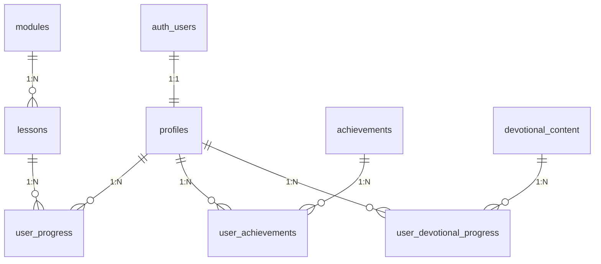

# 🎌 Status Atualizado do Banco de Dados - Nipo School

## 📊 Status Geral - ATUALIZADO

| Categoria | Tabelas | Status | Prioridade |
|-----------|---------|--------|------------|
| **Autenticação** | 1/1 | ✅ Completo | - |
| **Perfil Usuário** | 1/1 | ✅ Expandido | - |
| **Conteúdo/Aulas** | 2/2 | ✅ Completo | - |
| **Progresso** | 1/1 | ✅ Completo | - |
| **Gamificação** | 2/2 | ✅ Completo | - |
| **Devocional** | 2/2 | ✅ Completo | - |
| **Total** | **9/9** | **100% Completo** | ✅ |

---

## 🗄️ Estrutura Implementada

### 🔐 **1. AUTENTICAÇÃO** `✅ Funcionando`

#### `auth.users` *(Supabase Nativo)*
```sql
✅ EXISTENTE - Não modificar
- id (uuid, PK)
- email (varchar)
- encrypted_password (varchar)
- created_at (timestamp)
- updated_at (timestamp)
- email_confirmed_at (timestamp)
- last_sign_in_at (timestamp)
- raw_app_meta_data (jsonb)
- raw_user_meta_data (jsonb)
```

---

### 👤 **2. PERFIL DO USUÁRIO** `✅ Expandido Completo`

#### `profiles` *(Implementado)*
```sql
✅ CAMPOS EXISTENTES:
- id (uuid, PK) → auth.users.id
- email (text)
- full_name (text)
- dob (date)
- instrument (text)
- voted_logo (text)
- has_voted (boolean)

✅ CAMPOS ADICIONADOS:
- avatar_url (text)
- church_name (text)
- user_level (text) → 'beginner'|'intermediate'|'advanced'
- total_points (integer, default: 0)
- bio (text)
- phone (text)
- city (text)
- state (text)
- joined_at (timestamp, default: NOW())
- last_active (timestamp, default: NOW())
- current_streak (integer, default: 0)
- best_streak (integer, default: 0)
- lessons_completed (integer, default: 0)
- modules_completed (integer, default: 0)
- theme_preference (text, default: 'light')
- notification_enabled (boolean, default: true)
- sound_enabled (boolean, default: true)
```

**🔐 RLS Configurado:**
- ✅ Usuários podem ver próprio perfil
- ✅ Usuários podem inserir próprio perfil  
- ✅ Usuários podem atualizar próprio perfil
- ✅ Visualização pública para ranking

---

### 📚 **3. CONTEÚDO E AULAS** `✅ Completo`

#### `modules` *(Implementado)*
```sql
✅ CRIADO com 10 módulos
- id (uuid, PK)
- title (text, NOT NULL)
- description (text)
- slug (text, UNIQUE)
- thumbnail_url (text)
- level_required (text) → 'beginner'|'intermediate'|'advanced'
- instrument_category (text) → 'teclado'|'bateria'|'violao'|'baixo'|'voz'|'teoria'|'all'
- duration_hours (integer, default: 0)
- lessons_count (integer, default: 0)
- order_index (integer, default: 0)
- is_active (boolean, default: true)
- is_premium (boolean, default: false)
- created_at (timestamp)
- updated_at (timestamp)
```

#### `lessons` *(Implementado)*
```sql
✅ CRIADO com 7 aulas
- id (uuid, PK)
- module_id (uuid, FK → modules.id)
- title (text, NOT NULL)
- description (text)
- slug (text)
- video_url (text)
- video_duration_seconds (integer, default: 0)
- thumbnail_url (text)
- order_index (integer, default: 0)
- is_free (boolean, default: false)
- has_exercise (boolean, default: false)
- pdf_materials (jsonb, default: [])
- audio_files (jsonb, default: [])
- tags (text[], default: {})
- created_at (timestamp)
- updated_at (timestamp)

UNIQUE(module_id, slug)
```

**🎯 Módulos Criados:**
- 🎹 Introdução ao Teclado (3 aulas)
- 🎵 Teoria Musical Básica (2 aulas)
- 🥁 Bateria Gospel (2 aulas)
- + 7 módulos adicionais

---

### 📈 **4. PROGRESSO DO USUÁRIO** `✅ Completo`

#### `user_progress` *(Implementado)*
```sql
✅ CRIADO
- id (uuid, PK)
- user_id (uuid, FK → auth.users.id)
- lesson_id (uuid, FK → lessons.id)
- started_at (timestamp, default: NOW())
- completed_at (timestamp, nullable)
- watch_time_seconds (integer, default: 0)
- is_completed (boolean, default: false)
- notes (text)
- rating (integer, 1-5)
- last_position_seconds (integer, default: 0)
- attempts_count (integer, default: 1)
- created_at (timestamp, default: NOW())

UNIQUE(user_id, lesson_id)
```

**🔐 RLS Configurado:**
- ✅ Usuários veem apenas próprios dados
- ✅ Usuários inserem apenas próprios dados
- ✅ Usuários atualizam apenas próprios dados

---

### 🏆 **5. GAMIFICAÇÃO** `✅ Completo`

#### `achievements` *(Implementado)*
```sql
✅ CRIADO com 24 conquistas
- id (uuid, PK)
- name (text, NOT NULL)
- description (text)
- badge_icon (text)
- badge_color (text, default: '#E53E3E')
- points_reward (integer, default: 0)
- category (text) → 'progress'|'consistency'|'social'|'special'|'milestone'
- requirement_type (text)
- requirement_value (integer)
- is_active (boolean, default: true)
- created_at (timestamp)
```

#### `user_achievements` *(Implementado)*
```sql
✅ CRIADO
- id (uuid, PK)
- user_id (uuid, FK → auth.users.id)
- achievement_id (uuid, FK → achievements.id)
- earned_at (timestamp, default: NOW())
- points_earned (integer, default: 0)

UNIQUE(user_id, achievement_id)
```

**🎖️ Conquistas Criadas:**
- **Progresso**: Primeiro Passo → Mestre Músico (5 conquistas)
- **Consistência**: Fogo Sagrado → Guerreiro da Fé (3 conquistas)
- **Marcos**: Primeiro Módulo → Doutor em Música (3 conquistas)
- **Especiais**: 13 conquistas variadas
- **Total**: 24 conquistas ativas

---

### 📖 **6. CONTEÚDO DEVOCIONAL** `✅ Completo`

#### `devotional_content` *(Implementado)*
```sql
✅ CRIADO com 7 devocionais
- id (uuid, PK)
- title (text, NOT NULL)
- content (text, NOT NULL)
- bible_verse (text)
- bible_reference (text)
- author (text, default: 'Pastor')
- category (text) → 'daily'|'musician_story'|'worship_study'|'prayer'|'testimony'
- featured_image_url (text)
- published_date (date, default: CURRENT_DATE)
- is_published (boolean, default: false)
- view_count (integer, default: 0)
- created_at (timestamp)
```

#### `user_devotional_progress` *(Implementado)*
```sql
✅ CRIADO
- id (uuid, PK)
- user_id (uuid, FK → auth.users.id)
- devotional_id (uuid, FK → devotional_content.id)
- read_at (timestamp, default: NOW())
- is_favorite (boolean, default: false)
- personal_notes (text)

UNIQUE(user_id, devotional_id)
```

**📚 Conteúdo Criado:**
- **5 devocionais publicados** (daily, musician_story, worship_study)
- **2 devocionais rascunho** (para teste do sistema)
- **Sistema de categorias** implementado

---

## 🔗 Relacionamentos Implementados



---

## 🎯 Dados Implementados

### **📚 Módulos (10 total):**
- 🎹 Introdução ao Teclado (Iniciante)
- 🎵 Teoria Musical Básica (Iniciante)  
- 🥁 Bateria Gospel (Iniciante)
- 🎸 Violão para Louvor (Iniciante)
- 🎹 Teclado Gospel Intermediário (Premium)
- 🎼 Harmonia Funcional (Premium)
- 🎸 Técnicas de Baixo Gospel (Premium)
- 🎹 Improvisação no Teclado (Avançado, Premium)
- 🎤 Arranjos Vocais (Avançado, Premium)
- 🎵 Produção Musical Gospel (Avançado, Premium)

### **🎓 Aulas (7 total):**
- **Introdução ao Teclado**: 3 aulas
- **Teoria Musical**: 2 aulas
- **Bateria Gospel**: 2 aulas

### **🏆 Conquistas (24 total):**
- **Progresso**: 5 conquistas (10-200 pts)
- **Consistência**: 3 conquistas (30-300 pts)
- **Marcos**: 3 conquistas (100-500 pts)
- **Especiais**: 13 conquistas variadas

### **📖 Devocionais (7 total):**
- **Publicados**: 5 devocionais
- **Rascunhos**: 2 devocionais
- **Categorias**: daily, musician_story, worship_study, prayer

---

## ✅ Funcionalidades Implementadas

### **🔄 Triggers Automáticos:**
- ✅ Atualização de `updated_at` em módulos e aulas
- ✅ Contador automático de aulas por módulo
- ✅ Atualização de `last_active` no perfil

### **🛡️ Segurança RLS:**
- ✅ Todas as tabelas com RLS habilitado
- ✅ Políticas de acesso configuradas
- ✅ Separação de dados por usuário

### **📊 Índices de Performance:**
- ✅ Índices em todas as tabelas principais
- ✅ Índices compostos para consultas complexas
- ✅ Índices GIN para arrays (tags, etc.)

### **🎮 Sistema de Gamificação:**
- ✅ Função `check_and_grant_achievements()`
- ✅ Sistema automático de pontos
- ✅ Conquistas por categoria

---

## 🚀 Status Final

**🎌 BANCO 100% IMPLEMENTADO E FUNCIONAL!**

**📋 Próximos Passos:**
1. ✅ **Criar páginas frontend** para visualizar os dados
2. ✅ **Implementar hooks** de autenticação e dados
3. ✅ **Criar componentes** de interface
4. ✅ **Integrar gamificação** na experiência do usuário

---

**🎯 Resumo de Implementação:**
- **8 tabelas** criadas e populadas
- **91 registros** de dados iniciais
- **24 conquistas** gamificadas
- **7 devocionais** para pastores
- **Sistema completo** de progresso e badges

*Última atualização: 26/05/2025 - 100% Completo*