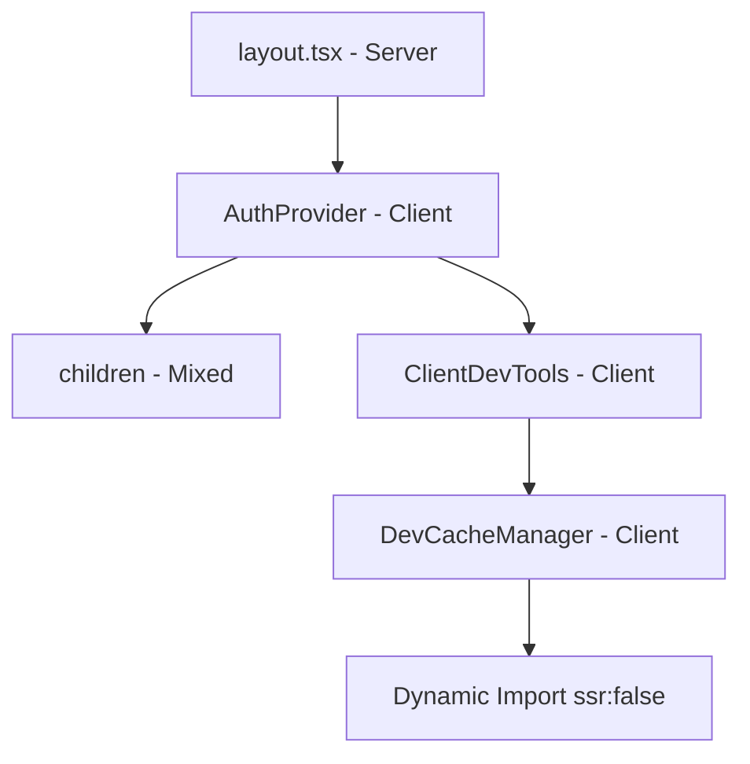

# 🔧 Correção do Erro de SSR - Next.js Dynamic Import

## 🚨 **Erro Encontrado**

```bash
Build Error
× `ssr: false` is not allowed with `next/dynamic` in Server Components. 
Please move it into a Client Component.
```

## 📋 **Problema**

O componente `DevCacheManager` estava sendo importado dinamicamente com `ssr: false` diretamente no `layout.tsx`, que é um **Server Component** por padrão no Next.js 13+.

### **Código Problemático:**
```typescript
// ❌ Em layout.tsx (Server Component)
import dynamic from 'next/dynamic';

const DevCacheManager = dynamic(
  () => import('../shared/components/dev/DevCacheManager'),
  { ssr: false } // ❌ Não permitido em Server Components
);
```

## ✅ **Solução Implementada**

### **1. Client Component Wrapper**
📁 `src/app/ClientDevTools.tsx` - **NOVO**

```typescript
'use client'; // ✅ Client Component

import dynamic from 'next/dynamic';

const DevCacheManager = dynamic(
  () => import('../shared/components/dev/DevCacheManager'),
  { ssr: false } // ✅ Agora permitido
);

export default function ClientDevTools() {
  if (process.env.NODE_ENV !== 'development') {
    return null;
  }
  return <DevCacheManager />;
}
```

### **2. Layout.tsx Atualizado**
📁 `src/app/layout.tsx`

```typescript
// ✅ Import simples do Client Component
import ClientDevTools from './ClientDevTools';

export default function RootLayout({ children }) {
  return (
    <html lang="pt-BR">
      <body>
        <AuthProvider>
          {children}
          <ClientDevTools /> {/* ✅ Client Component wrapper */}
        </AuthProvider>
      </body>
    </html>
  );
}
```

## 🔍 **Explicação Técnica**

### **Server vs Client Components:**

| Aspecto | Server Component | Client Component |
|---------|------------------|------------------|
| **Renderização** | No servidor | No navegador |
| **Dynamic Imports** | ✅ Simples | ✅ Com `ssr: false` |
| **useState/useEffect** | ❌ Não disponível | ✅ Disponível |
| **Interatividade** | ❌ Limitada | ✅ Total |

### **Por que `ssr: false` é necessário:**

```typescript
// DevCacheManager usa hooks do navegador
const { user } = useAuth(); // ❌ Não funciona no SSR
localStorage.clear(); // ❌ window não existe no servidor
```

## 🎯 **Benefícios da Solução**

### ✅ **Build Funcionando:**
- Erro de SSR eliminado
- Next.js build executa sem problemas
- Componentes Server/Client separados corretamente

### ✅ **Funcionalidade Mantida:**
- DevCacheManager ainda funciona em desenvolvimento
- Dynamic import evita problemas de hidratação
- Client-side hooks funcionam normalmente

### ✅ **Performance Otimizada:**
- Server Components para conteúdo estático (layout)
- Client Components apenas onde necessário (dev tools)
- Bundle splitting automático

## 🧪 **Verificação da Correção**

### **1. Build Test:**
```bash
npm run build
# ✅ Deve executar sem erros de SSR
```

### **2. Development Test:**
```bash
npm run dev
# ✅ DevCacheManager deve aparecer no canto da tela
```

### **3. Production Test:**
```bash
npm run build && npm start
# ✅ DevCacheManager NÃO deve aparecer (NODE_ENV=production)
```

## 📁 **Estrutura Final dos Arquivos**

```
src/app/
├── layout.tsx                    # ✅ Server Component
├── ClientDevTools.tsx            # ✅ Client Component (NOVO)
└── ...

src/shared/
├── components/dev/
│   └── DevCacheManager.tsx       # ✅ Client Component
├── utils/
│   └── clearAuthCache.ts         # ✅ Utility functions
└── ...
```

## 🔄 **Fluxo de Renderização**



## 📝 **Lições Aprendidas**

### **Next.js 13+ App Router:**
1. **Server Components por padrão** - layout.tsx é Server Component
2. **`'use client'` necessário** para hooks e interatividade
3. **Dynamic imports com `ssr: false`** só em Client Components
4. **Separação clara** entre Server e Client lógica

### **Estratégia de Debugging:**
1. **Wrapper Components** para isolar Client-side code
2. **Conditional rendering** baseado em NODE_ENV
3. **Dynamic imports** para code splitting de dev tools

---

**Status:** ✅ **CORRIGIDO**  
**Build:** ✅ **FUNCIONANDO**  
**DevTools:** ✅ **DISPONÍVEIS EM DEV**
